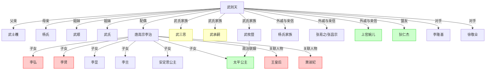

```mermaid
graph TD
    WZT[武则天] -->|父亲| WSY[武士彠]
    WZT -->|母亲| YS[杨氏]
    WZT -->|姐妹| WS[武顺]
    WZT -->|姐妹| WS2[武氏]

    WZT -->|配偶| TGY[唐高宗李治]
    TGY -->|子女| LH[李弘]
    TGY -->|子女| LX[李贤]
    TGY -->|子女| LZ[李显]
    TGY -->|子女| LD[李旦]
    TGY -->|子女| AD[安定思公主]
    TGY -->|子女| TP[太平公主]

    TGY -->|关联人物| WHH[王皇后]
    TGY -->|关联人物| XSF[萧淑妃]

    WZT -->|武氏家族| WS3[武三思]
    WZT -->|武氏家族| WCY[武承嗣]
    WZT -->|武氏家族| WYJ[武攸暨]
    WYJ -->|政治联姻| TP

    WZT -->|外戚与亲信| YSJZ[杨氏家族]
    WZT -->|外戚与亲信| ZYZ[张易之/张昌宗]
    WZT -->|外戚与亲信| SGYW[上官婉儿]

    WZT -->|盟友| DRJ[狄仁杰]
    WZT -->|对手| LLC[李隆基]
    WZT -->|对手| XJY[徐敬业]

    classDef red fill:#ffcccc,stroke:#ff0000
    classDef green fill:#ccffcc,stroke:#00cc00
    classDef yellow fill:#ffffcc,stroke:#cccc00

    class LH,LX,XSF,WHH red
    class TP,DRJ,SGYW green
    class WCY,WS3,YZSJZ yellow

```